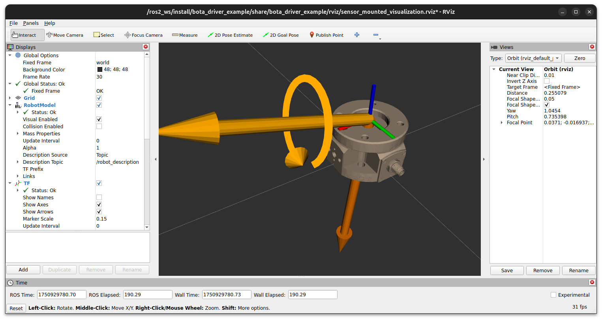

# bota_driver_ros2_example

This repository includes an ROS2 package (**bota_driver_example**) that shows how to use the standard node from the Bota Driver for ROS2 with a Bota FT sensor. 

Updated documentation about the **bota driver ROS2 node** can be found in [Bota FT Stack documentation](https://code.botasys.com/en/gen_a/layer1/driver/driver_ros2.html).

# About
- **Author**: Bota Systems AG (support@botasys.com) 
- **Contributors**: Raul Cruz-Oliver
- **Date**: 26 June 2025 
- **Place**: Zurich, Switzerland 

# Contents

- **bota_config/**: Contains JSON configuration files for the Bota Driver node. These files define the parameters for the driver, such as communication interface, and other settings. The parameters in this files are documented in the [here](https://code.botasys.com/en/latest/layer1/driver_concept.html#configuration-file).
 - **docs/**: Contains images used in this README file.
- **launch/**: Contains launch files.
   - **bota_ft_sensor_mounted.launch.py**: launches a robot state publisher node, the Bota Driver node, and RVIZ for visualization of the Bota FT sensor mounted on a robot.
   - **imu_filter_madgwick.launch.py**: launches the IMU filter node for estimating the orientation of the sensor based on IMU data. This launch file can only be used when the bota node is already running and the IMU message is being populated.
   - **plotjuggler.launch.py**: launches PlotJuggler for visualizing the Bota FT sensor data. This launch file can only be used when the bota node is already running and the sensor data is being published.
- **plotjuggler/**: Contains configuration files for PlotJuggler, a tool for visualizing and analyzing ROS2 data. These files define the topics to be visualized and the layout of the PlotJuggler interface.
- **rviz/**: Contains configuration files for RVIZ, a 3D visualization tool for ROS2. These files define the visualization settings for the Bota FT sensor, including the sensor's coordinate frame and the wrench measurements.
- **urdf/**: Contains a URDF (Unified Robot Description Format) file for a Bota FT sensor mounted on a robot. It leverages the xacros included in the **bota-driver** pacakge to define the sensor links and joints. More information about the xacros included in the **bota-driver** package can be found in the [Bota FT Stack documentation](https://code.botasys.com/en/gen_a/layer1/driver/driver_ros2.html).
- **LICENSE**: License file for the Bota Driver ROS2 example package, which is BSD 3-Clause License with Attribution Requirement. It must be reproduced in any derivated work.

# Package description

The **bota_driver_example** package provides an example of how to use the ROS2 node included in the **bota_driver** package to interface with a Bota FT sensor. 

It includes launch files for starting the driver node, visualizing the sensor data in RVIZ, and using PlotJuggler for real-time data visualization. Additionally, it provides configuration files for the driver node and visualization tools.

# Getting Started

### 1. Clone the [bota_driver_ros2](https://gitlab.com/botasys/drivers/bota_driver_ros2) and [bota_driver_ros2_example](https://gitlab.com/botasys/drivers/bota_driver_ros2_example) repositories in the source folder of your ROS2 workspace.

```bash
# go to your workspace src folder
cd ~/ros2_ws/src

# clone the repository containing the bota_driver package
git clone https://gitlab.com/botasys/drivers/bota_driver_ros2.git

# clone the repository containing the bota_driver_example package
git clone https://gitlab.com/botasys/drivers/bota_driver_ros2_example.git
```

Example workspace structure after cloning:

```text
~/ros2_ws/
├── src/
│   ├── bota_driver_ros2/           # cloned repository (bota_driver package)
│   ├── bota_driver_ros2_example/   # cloned repository (bota_driver_example package)
│   └── other_package/
├── build/
├── install/
└── log/
```

### 2. Build your workspace using `colcon build`.

```bash
# go to your workspace root folder
cd ~/ros2_ws

# build the workspace
colcon build
```

### 3. Start the Bota driver node standalone
The `bota_ft_sensor_link_name` parameter defines the name of your FT sensor and ensures consistent naming across topics and frames.

```bash
source <WORKSPACE_DIR>/install/setup.bash
ros2 run bota_driver bota_driver_node --ros-args \
    -p node_name:=bota_ft_sensor \
    -p config_file:="<WORKSPACE_DIR>/src/bota_driver_ros2_example/bota_config/bota_socket.json" \
    -p output_rate:=500 
```

### 4. Visualize the sensor in RVIZ
To visualize the Bota FT sensor in RVIZ, you can use the provided launch file that includes the robot state publisher, the Bota driver node, and RVIZ with a pre-configured setup.

```bash
# stop the previously running bota_driver_node if applicable

# install Rviz2 if you don't have it yet
sudo apt install ros-<DISTRO>-rviz2

# launch the bota_ft_sensor_mounted.launch.py
source <WORKSPACE_DIR>/install/setup.bash
ros2 launch bota_driver_example bota_ft_sensor_mounted.launch.py \
    bota_ft_sensor_link_name:=bota_ft_sensor
```
> **Note**: The `bota_ft_sensor_link_name` parameter is used by both the `bota_driver_node` to publish topics in the correct frames and by the xacro to define frames with corresponding matching names.

After launching this, RVIZ should open automatically, displaying the sensor's frames and meshes, as well as the measured wrench.

> **Note**: The sensor outputed wrench is not yet tared, please refer to the next step to zero the sensor.

### 5. Tare the sensor

Always, when working with FT sensor, before using the measurements for your application, you need to tare (zero) the sensor to establish a baseline. The node exposes a ROS2 service `/bota_driver_node/tare` that you can call to perform the tare operation. This will set the current force/torque readings as zero.

Open a new terminal and run:

```bash
source <WORKSPACE_DIR>/install/setup.bash
ros2 service call /bota_ft_sensor/tare std_srvs/srv/Trigger {}
```

Now, the wrench diplayed in RVIZ should be zeroed, you can try to apply a force to the sensor and see how the visualization changes accordingly.



*Figure 1: RVIZ visualization showing the Bota FT sensor with force/torque measurements displayed as colored arrows and the sensor's coordinate frame.*

### 6. Visualize Data with PlotJuggler
If you want to visualize the sensor data in real-time, you can use PlotJuggler, a powerful tool for visualizing and analyzing ROS2 data. The `bota_driver_example` package includes a launch file to start PlotJuggler with the Bota FT sensor data.  

```bash
# install PlotJuggler if you don't have it yet
sudo apt install ros-<DISTRO>-plotjuggler ros-<DISTRO>-plotjuggler-ros

# launch PlotJuggler
source <WORKSPACE_DIR>/install/setup.bash
ros2 launch bota_driver_example plotjuggler.launch.py
``` 

### 7. Enable IMU Orientation (Optional)
If your sensor includes an IMU on board and it is enabled, you can estimate the sensor orientation. This is particularly useful for applications that require knowledge of the sensor's orientation in space, such as gravity and intertial compensation. If you want to learn more about the advantages of using the IMU for Force Control applications, please write us on support@botasys.com.

> **Note**: In GEN0 sensors, an IMU is only on board in the EtherCAT variant, being it always enabled. On the contrary, all GENA sensors mount an IMU, but it is only enabled when the "app submode" parameter is set to "2". For more information about how to configure GENA sensors, please refer to the [official GENA user manual](https://app-eu1.hubspotdocuments.com/documents/24886714/view/1227219741?accessId=0fb04d).

For the puposes of this example, we are using the open-source **imu_filter_madgwick** package, which provides a Madgwick filter implementation for estimating the orientation of the sensor based on IMU data. 

```bash
# install the imu_filter_madgwick package if you don't have it yet
sudo apt install ros-<DISTRO>-imu-filter-madgwick

# launch the IMU filter node
source <WORKSPACE_DIR>/install/setup.bash
ros2 launch bota_driver_example imu_filter_madgwick.launch.py
```

After starting the IMU filter node, you need to update the RVIZ configuration to properly display the sensor orientation. 
Change the **Fixed Frame** from `robot_mounting_link` to `world` in the Global Options panel on the left side. 

The sensor visualization will now display the real-time orientation based on IMU data, and you can observe how the sensor's coordinate frame rotates as you move the physical sensor.

### Next Steps
- Your sensor is now ready to provide force/torque measurements (and IMU data if enabled).
- Check the published topics using `ros2 topic list`
- Check the available services using `ros2 service list`
- Test different driver configurations by modifying the parameters in the JSON files under **bota_driver_example/bota_config/**, these parameters are documented [here](https://code.botasys.com/en/gen_a/layer1/driver_concept.html#configuration-file). Likewise, explore the available parameters for the driver node, they are documented [here](https://code.botasys.com/en/gen_a/layer1/driver_ros2_standard_node.html).

# License
See [LICENSE](LICENSE) file.
